### **Binome : Dodo Mamane Abari**

 **Modélisation d’un Système de carburant d’avion**

1. **Présentation du projet**

Le projet consiste en la modélisation d’un système de carburant pour avion en respectant un certain nombre de contraintes. En effet, il s'agit de déterminer la masse du carburant en se basant sur les informations provenant de différents capteurs et en appliquant les formules appropriées. Ce projet s’inscrit dans le cadre du module de Mécatronique. Les objectifs du projet sont :

- La modélisation du système de carburant
- Utilisation du cycle de développement en V
- La génération du code
- Les tests unitaires et système
2. **le systèmes de carburant**
1. **Spécification (cahier de charge)**

Le système de carburant, est un système dont les fonctions principales peuvent être résumées à :

- Fonction de mesure : mesure du carburant dans les réservoirs de l’avion
- Fonction de Management : commande des organes du ou des circuits de circulation du carburant (ravitaillement au sol, en vol, transfert …)

L’objectif du système à modéliser est d’obtenir la masse du carburant dans les réservoirs. Pour ce faire, le système doit en mesure de modéliser les éléments suivants :

- Capteur FCS (Fuel Characteristic Sensor) qui combine les 3 capteurs suivants :
  - Une sonde de température
  - Un densimètre (capteur de densité)
  - Un CIC
- Capteurs Jauge :
  - La jauge permet de mesurer la hauteur de fluide dans les réservoirs.
- En prenant les informations données par ces capteurs, le système à modéliser doit déterminer la masse du carburant dans le réservoir.
2. **Conception générale**

A partir des spécifications , est conçu le système suivant:

La figure ci-dessus représente le système de manière la plus générale, à l’entrée du système sont les données récupérées à partir des capteurs et à sa sortie la masse.

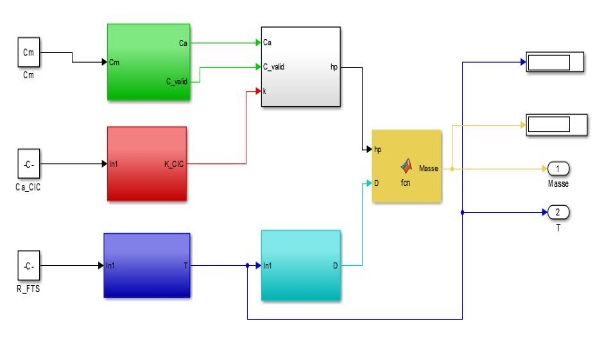

3. **conception détaillée**
1. **Architecture du bloc de calcule de la capacité active**

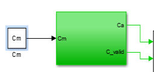 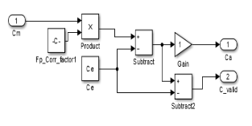

2. **Architecture du bloc de calcul de la densité k\_CIC**

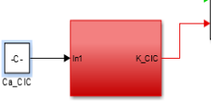 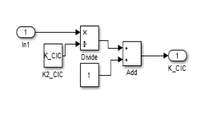

3. **Architecture du bloc de calcul de la température**

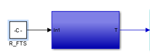 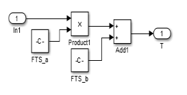

4. **Architecture du bloc de calcul de la hauteur du probe hp**

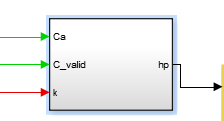 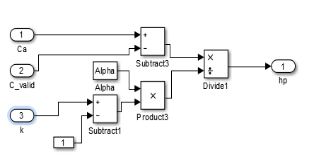

5. **Architecture du bloc d calcul de la densité D**

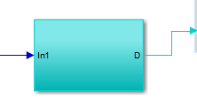 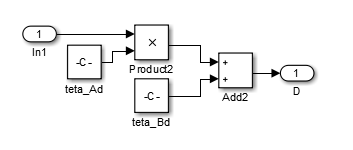

6. **Architecture du bloc de calcul de la Masse**

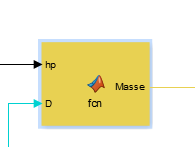

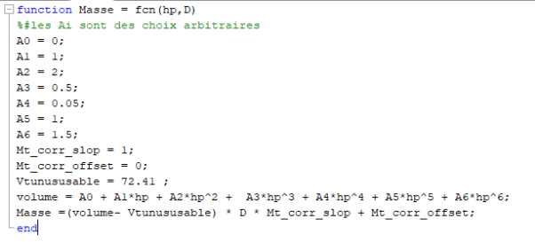

3. **Codage**

Pour le codage l’outil utilisé est Simulink, pour des raisons de flexibilité et rapidité. Le model based design est aujourd’hui la tendance car il permet au programmeur de se concentrer sur la modeĺisation du système mais aussi il permet de réduire le TTM (Time To Market).

 Simulink est une plate-forme de simulation multi-domaine et de modélisation

de systèmes dynamiques. Il fournit un environnement graphique et un ensemble de bibliothèques contenant des blocs de modélisation qui permettent le design précis, la simulation, l’implémentation et le contrôle de systèmes de communications et de traitement du signal. Simulink est intégré à MATLAB, fournissant ainsi un accès immédiat aux nombreux outils de développement algorithmique, de visualisation et d’analyse de données de MATLAB. (Source Wikipédia)

4. **Tests**
1. **Tests Unitaires**
1. **Tests Systèmes**

Constantes utilisés pour le test système

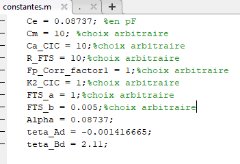

Pour ces valeurs on obtient les résultats suivant:

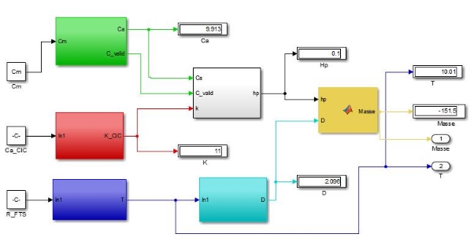

**Masse de carburant = -151.5 Température = 10.01**

5. **Génération du code**

La génération est faite à partir de l’outil Embedded Coder de matlab. voir le dossier code pour consulter le code.

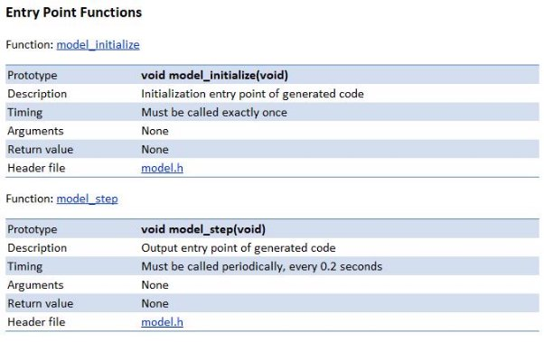

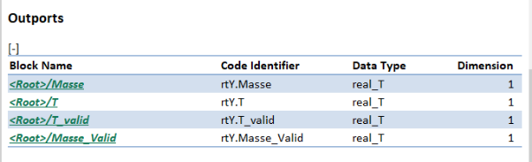

6. **Conclusion**

Les étapes de réalisation du projet suivent le cycle en V. D’abord il nous a fallu connaître les exigences du projet et à partir de ces exigences nous avons mis en place une architecture générale de notre système appelée architecture haut niveau qui correspond aux exigences de haut niveau. A partir de cette architecture nous adoptons une approche systémique en décomposant le HLR en sous système afin de mettre en évidence le LLR qui correspond aux exigences de bas niveaux. Une fois cette étape terminée nous avons entamé l’étape de l’implémentation qui consiste ici en la génération du code. Et pour finir vient la phase des tests( tests unitaires et tests systèmes). On a vérifié ici si pour les mêmes entrées le résultat obtenu en exécutant le code généré est le même que celui du schéma bloc. Cela fait partie des étapes de tests de la couverture du code.

**Annexe**

1. **Les formules Utilisées**
- La capacité électrique

  

  

- La capacité à vide

  

- La capacité active

  

- La température
- La permittivité

  

- La densité

  

- La hauteur du probe

  

- Le volume

  

- La masse de carburant

  

2. **Les constantes Utilisées**

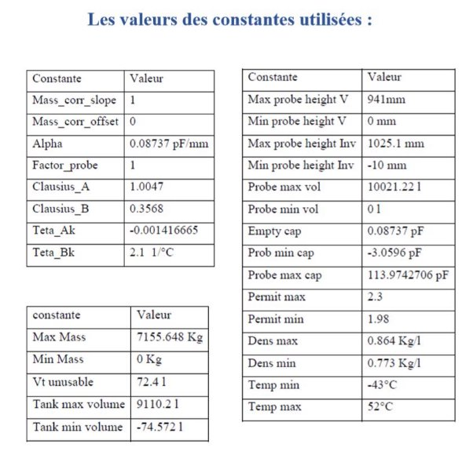
